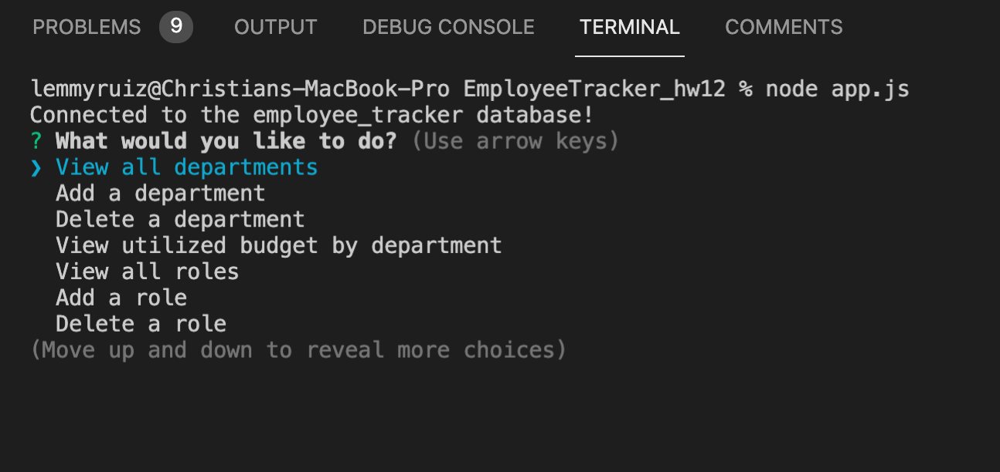

# EMPLOYEE TRACKER
# Description
  Blank blank blank
  
# Table of Contents
  
  - [installation](#installation)
  - [Steps](#steps)
  - [Usage](#usage)
  - [Credits](#credits)
  - [License](#license)
  
 # Installation
  Click the green "code", and click the ssh link, go into terminal and clone into local machine. 

 # Steps
### Step One
  Clone Code
### Step Two
   Run "npm i" to get dependencies
### Step Three
   Once Installed, run using "node app.js"

# Usage
  Install and use at leaisure for brainstorming

# Credit
 Me(Christian Ruiz) and Google

# License
 
 For more info: https://choosealicense.com/licenses/mit/

# GitHub Username
 cruiz328 

## Email:

lemmy125@gmail.com

## Video Link:
https://www.youtube.com/watch?v=UiefOEvG52w
## Images

